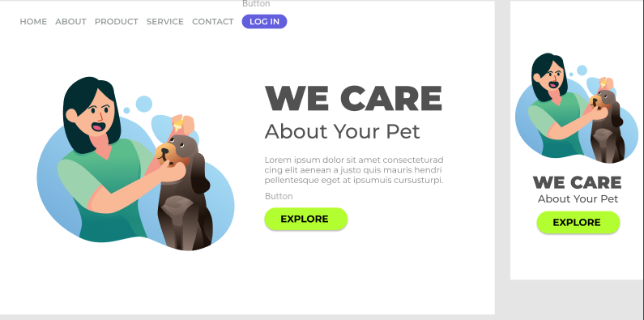

# Responsive Pet Landing Page

  

Landing page responsiva desenvolvida com HTML e CSS puro, com foco em:

- Estrutura semântica
- Flexbox
- Responsividade
- Boas práticas de CSS
- Organização de classes (BEM-like)

## 📱 Responsivo

Adaptado para desktop e mobile.

## 🚀 Tecnologias

- HTML5
- CSS3

## 📌 Objetivo

Projeto desenvolvido para fortalecer fundamentos de layout e responsividade.
